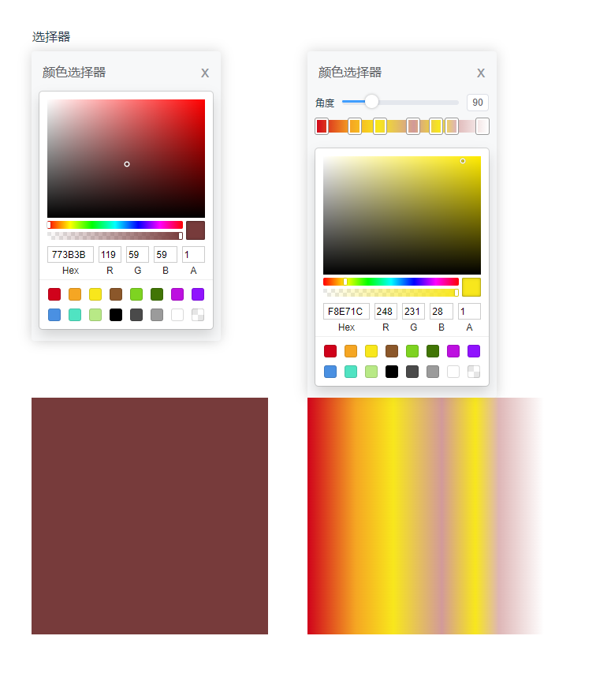

# guapikeji-color-picker

[](https://www.npmjs.com/package/guapikeji-color-picker)
[](https://www.npmjs.com/package/guapikeji-color-picker)
[](https://github.com/themismin/guapikeji-color-picker/stargazers)

**Element-Plus 风格的 Vue 2 颜色选择器**，支持纯色和渐变色选择。

采用 Element-Plus ColorPicker 的 API 设计，提供简洁易用的 v-model 双向绑定和标准化的事件系统。



## ✨ 特性

- 🎨 支持线性颜色和渐变色选择
- 🔄 v-model 双向绑定
- 📦 多种颜色格式支持（hex、rgb、rgba、hsl、hsla）
- 🎯 Element-Plus 风格的 API 设计
- 🌈 渐变色支持角度调节和多色点
- 💪 TypeScript 友好
- 📱 响应式设计

## [Live Demo](https://cnlhb.github.io/guapikeji-color-picker/)

## 📦 安装

### NPM

```bash
npm install guapikeji-color-picker
# 或
yarn add guapikeji-color-picker
```

## 🔨 使用

### 全局注册

```javascript
import Vue from 'vue'
import ColorPicker from 'guapikeji-color-picker'

Vue.use(ColorPicker)
```

### 局部注册

```javascript
import ColorPicker from 'guapikeji-color-picker'

export default {
  components: {
    ColorPicker
  }
}
```

## 📖 示例

### 基础用法

```vue
<template>
  <!-- 线性颜色选择器 -->
  <ColorPicker v-model="color" @change="handleChange" />
</template>

<script>
export default {
  data() {
    return {
      color: '#409EFF'
    }
  },
  methods: {
    handleChange(value) {
      console.log('颜色改变:', value)
    }
  }
}
</script>
```

### 模式切换

组件内置了纯色/渐变模式切换功能，用户可以在选择器面板内自由切换：

```vue
<template>
  <ColorPicker
    v-model="color"
    @change="handleChange"
    @mode-change="handleModeChange"
  />
</template>

<script>
export default {
  data() {
    return {
      color: '#409EFF'
    }
  },
  methods: {
    handleChange(value) {
      console.log('颜色改变:', value)
    },
    handleModeChange(mode) {
      console.log('模式切换为:', mode) // 'linear' 或 'gradient'
    }
  }
}
</script>
```

### 禁用模式切换

如果你希望固定为某个模式，可以使用 `disable-mode-switch` 属性：

```vue
<template>
  <!-- 固定为纯色模式 -->
  <ColorPicker v-model="color" mode="linear" disable-mode-switch />

  <!-- 固定为渐变模式 -->
  <ColorPicker v-model="gradient" mode="gradient" disable-mode-switch />
</template>
```

### 带透明度

```vue
<template>
  <ColorPicker
    v-model="color"
    show-alpha
    color-format="rgba"
    @change="handleChange"
  />
</template>

<script>
export default {
  data() {
    return {
      color: 'rgba(64, 158, 255, 0.8)'
    }
  }
}
</script>
```

### 渐变色选择器

```vue
<template>
  <ColorPicker
    v-model="gradient"
    mode="gradient"
    @change="handleGradientChange"
  />
</template>

<script>
export default {
  data() {
    return {
      gradient: 'linear-gradient(90deg, #fff 0%, #000 100%)'
    }
  },
  methods: {
    handleGradientChange(value) {
      console.log('渐变改变:', value)
    }
  }
}
</script>
```

### 禁用角度调节

```vue
<template>
  <ColorPicker
    v-model="gradient"
    mode="gradient"
    disable-deg
  />
</template>
```

## 📚 API

### Props

| 参数 | 说明 | 类型 | 可选值 | 默认值 |
| --- | --- | --- | --- | --- |
| modelValue / v-model | 绑定值 | string | — | '#409EFF' |
| mode | 组件默认模式 | string | linear / gradient | linear |
| disable-mode-switch | 是否禁用内部模式切换按钮 | boolean | — | false |
| show-alpha | 是否支持透明度选择 | boolean | — | false |
| color-format | 颜色格式 | string | hex / rgb / rgba / hsl / hsla | hex |
| predefine | 预定义颜色 | array | — | [] |
| size | 组件尺寸 | string | large / default / small | default |
| disabled | 是否禁用 | boolean | — | false |
| disable-deg | 渐变模式下是否禁用角度调节 | boolean | — | false |
| popper-class | 下拉框的类名 | string | — | '' |

### Events

| 事件名 | 说明 | 回调参数 |
| --- | --- | --- |
| update:modelValue | v-model 更新事件 | (value: string) |
| change | 颜色值改变时触发（确认后） | (value: string) |
| active-change | 实时颜色改变（拖动时） | (value: string) |
| visible-change | 面板显示/隐藏时触发 | (visible: boolean) |
| mode-change | 模式切换时触发 | (mode: 'linear' \| 'gradient') |

### 颜色值格式

#### 线性模式（mode="linear"）

- **hex**: `'#409EFF'` 或 `'#409EFF80'`（带透明度）
- **rgb**: `'rgb(64, 158, 255)'`
- **rgba**: `'rgba(64, 158, 255, 0.8)'`
- **hsl**: `'hsl(210, 100%, 62%)'`
- **hsla**: `'hsla(210, 100%, 62%, 0.8)'`

#### 渐变模式（mode="gradient"）

CSS gradient 字符串，例如：
```css
linear-gradient(90deg, rgba(255, 255, 255, 1) 0%, rgba(0, 0, 0, 1) 100%)
```

## 🎯 渐变色使用技巧

### 添加颜色点

点击渐变条可以添加新的颜色点

### 删除颜色点

选中颜色点后，按 **Backspace** 或 **Delete** 键可删除（至少保留2个颜色点）

### 调整颜色点位置

拖动颜色点可调整其在渐变条中的位置

### 调整渐变角度

使用角度滑块可调整渐变方向（0-360度）

## 🔄 从旧版本迁移

如果你正在使用旧版本的 API，这里是迁移指南：

### Props 变更

| 旧 API | 新 API | 说明 |
| --- | --- | --- |
| `type` | `mode` | 重命名为更清晰的 mode |
| `pColor` | `v-model` | 使用 v-model 绑定颜色值（字符串） |
| `pColors` | `v-model` | 渐变模式下使用 v-model（CSS gradient 字符串） |
| `pDeg` | 包含在 v-model 中 | 角度信息包含在 gradient 字符串中 |
| `disabledColorDeg` | `disable-deg` | 重命名为 kebab-case |
| `showClose` | 已移除 | 简化 UI，统一风格 |
| `closeOnClickBody` | 已移除 | 简化交互逻辑 |
| `titleConfig` | 已移除 | 简化 UI 配置 |

### Events 变更

| 旧 API | 新 API | 说明 |
| --- | --- | --- |
| `@changeColor` | `@change` | 标准化事件名 |
| `@onClose` | `@visible-change` | 更标准的事件命名 |

### 迁移示例

**旧版本：**
```vue
<ColorPicker
  type="linear"
  :p-color="pColor"
  :p-deg="90"
  :show-close="true"
  @changeColor="changeColor"
  @onClose="onClosePicker"
/>
```

**新版本：**
```vue
<ColorPicker
  mode="linear"
  v-model="color"
  @change="handleChange"
  @visible-change="handleVisibleChange"
/>
```

## 🛠️ 开发

### 本地开发

```bash
# 安装依赖
yarn install

# 启动开发服务器
yarn dev

# 构建库文件
yarn build

# 构建演示文件
yarn build:demo

# 代码检查
yarn lint

# 代码格式化
yarn format
```

## 📄 许可证

MIT

## 🙏 致谢

- [vue-color](https://github.com/xiaokaike/vue-color) - 颜色选择器 UI 组件
- [Element Plus](https://element-plus.org/) - API 设计参考
- [color-scales](https://github.com/politiken-journalism/scale-color-perceptual) - 颜色计算库

